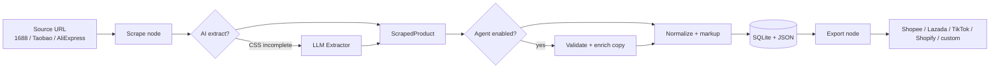

# Cross-Border — Architecture

## Vision

**One gateway, three clients, one business pipeline:**

```
                    ┌─────────────────────────────────────┐
                    │         Gateway (FastAPI)              │
                    │  jobs · config · agent · workflows     │
                    └───────────┬─────────────┬─────────────┘
                                │             │
              ┌─────────────────┼─────────────┼─────────────────┐
              ▼                 ▼             ▼                 ▼
         Web UI (/ui)      CLI (remote)   CLI (--local)    External agent
         React panel       scraper agent  in-process       MCP / API key (future)
```

The gateway is the **only orchestration boundary**. CLI and web UI are clients — not parallel engines.

## Business flow (cross-border listing)



| Stage | Role | Implementation |
|-------|------|----------------|
| Trigger | Start a run | URL submit, CLI, agent tool |
| Scrape | Fetch + parse product | `run_scrape_pipeline` → `ScrapeEngine`, `scrape_product` tool |
| AI enrich | Optional extract + listing copy | `AIExtractor` (fallback), `ScrapeAgent` (enrich), gateway LLM agent |
| Store | Persist catalog | `ProductStore` (SQLite + JSON) |
| Export | Publish listing | Marketplace exporters, `export_listing` tool |
| Monitor | Live status | SSE batches, `/gateway/status` |

## Layer structure

```
src/
├── gateway/              # Control plane (NEW)
│   ├── tools.py          # Agent-callable tools
│   ├── workflows.py      # Declarative pipelines
│   ├── agent_runtime.py  # LLM + tool loop
│   └── client.py         # HTTP client for CLI
├── server/               # FastAPI gateway host (see server/README.md)
│   ├── api/registry.py   # Route registration
│   ├── services/facade.py # ScrapeManager for gateway/CLI
│   ├── schemas/          # Pydantic models by domain
│   └── routers/
│       ├── gateway.py    # /gateway/* agent + workflows
│       ├── jobs.py       # batches, SSE
│       └── ...
├── core/engine/          # Playwright worker pool
├── core/ai/              # Extraction + post-process agent
├── cli/                  # Typer — local ops + gateway client
├── config/               # .env (panel auth) + ui_config.json (everything else)
apps/web/                 # Web client (React + Vite)
config/ui_config.json     # Panel config (AI, engine, marketplaces)
```

## Config model

| File | Purpose | Edited via |
|------|---------|------------|
| `.env` | `PANEL_*` login only | `scraper setup` |
| `config/ui_config.json` | AI keys, engine, marketplaces | Web Settings, `PATCH /config/panel` |
| `config/sites.yaml` | Site profiles | File / future UI |
| `config/proxies.txt` | Proxy pool | File |

## Gateway API

| Endpoint | Client | Purpose |
|----------|--------|---------|
| `GET /gateway/status` | CLI, UI | Control plane health |
| `GET /gateway/tools` | Agent, UI | Tool registry |
| `GET /gateway/workflows` | CLI, UI | Workflow templates |
| `POST /gateway/agent/run` | CLI, UI, bots | AI agent with tools |
| `POST /gateway/workflows/{id}/run` | CLI | Declarative pipeline |
| `GET /jobs/{id}/stream` | Web UI | Live batch SSE |
| `PATCH /config/panel` | Web UI | Panel JSON config |

## CLI

```bash
uv run serve                              # start gateway daemon
scraper gateway                           # gateway status
scraper agent "scrape this URL and list marketplaces"   # remote agent
scraper agent "..." --local               # in-process agent (no HTTP)
scraper workflow scrape_to_export --url "..." --marketplace shopify
```

## Workflows

Built-in templates in `src/gateway/workflows.py`:

- **scrape_to_export** — scrape URL → dry-run export preview
- **batch_scrape** — concurrent multi-URL batch
- **catalog_snapshot** — products + marketplace readiness

Future: visual workflow editor in the panel, user-defined JSON/YAML workflows, webhook triggers.

## Agent tools

Registered in `src/gateway/tools.py`:

| Tool | Action |
|------|--------|
| `scrape_product` | Single URL scrape |
| `export_listing` | Marketplace publish / dry-run |
| `list_products` | Catalog query |
| `list_marketplaces` | Integration status (any platform in JSON) |
| `submit_batch` | Concurrent batch |
| `runtime_status` | Ops snapshot |

Marketplace config supports **any platform** via `marketplaces.{id}.credentials` in `ui_config.json`.

## Roadmap

### Phase 1 ✅ (current)
- Gateway router + tool registry + agent runtime
- CLI gateway/agent/workflow commands
- Panel JSON config for all service secrets

### Phase 2 ✅ (current)
- Web UI: **Agent** page — chat + tool trace + cron schedules
- Prompt library: `libs/prompts/*.md` (recommended templates)
- Background cron scheduler (`config/agent_schedules.json`)
- `GET /gateway/prompts`, `/gateway/schedules`, `/gateway/runs`

### Phase 3 (next)
- Durable job queue (Redis) for multi-worker gateway
- MCP server exposing gateway tools
- Visual workflow builder in the panel
- Webhook triggers + scheduled cron workflows

### Phase 4 (in progress)
- Multi-tenant workspaces
- Sandbox export dry-runs
- **Telegram** channel adapter (`gateway/integrate/runners/telegram/`) — control chat → gateway agent
- Slack / webhook channel adapters (planned)

## Design principles

1. **Gateway first** — new features expose a tool or API route before CLI-only shortcuts.
2. **Config in JSON** — panel-editable; `.env` is deploy bootstrap only.
3. **Extensible marketplaces** — credential schema in JSON, exporter registry in code.
4. **Observable** — SSE for batches, `/gateway/status` for ops, structured tool logs.
5. **Self-hosted** — single binary + Playwright, no cloud dependency.
