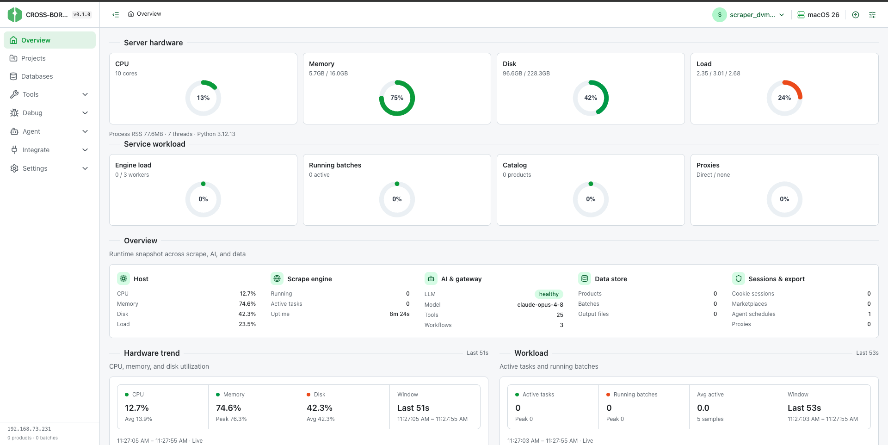
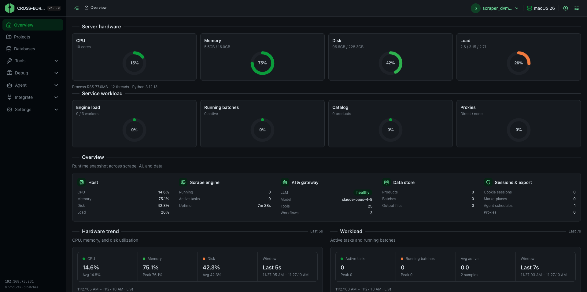

<p align="center">
  
</p>

<h1 align="center">Cross-Border</h1>

<p align="center">
  <strong>Self-hosted AI agent hub</strong> — run a gateway agent from the web panel, CLI, or chat apps;<br/>
  automate work with skills, cron schedules, and plugins.<br/>
  Built-in <strong>scrape and catalog analysis</strong> for cross-border e-commerce<br/>
  (1688, Taobao, AliExpress → Shopee, Lazada, TikTok Shop, Shopify).
</p>


---

<p align="center">
  
  
</p>

---

## What it is

| Layer | What it does |
|---|---|
| **Gateway agent** | LLM + tools + skills — chat, cron jobs, workflows |
| **Agent panel** | Configure LLM, skills, schedules, health, firewall, App Store |
| **Integrate** | Same agent over **Telegram**, Discord, Slack, Email |
| **Scrape & data** | Concurrent engine, AI extraction, catalog monitor, batch jobs, export |
| **Hub & registry** | Built-in + installable **skills** (`SKILL.md`), **source plugins** (ZIP), App Store drivers |
| **Self-host** | Local dev, Docker, VPS one-liner — your machine or your server |

## Requirements

| Tool | Version | Notes |
|---|---|---|
| Python | **3.12+** | Install via [python.org](https://www.python.org/downloads/) |
| uv | latest | Auto-installed by setup scripts |
| Node.js | **20+** | Required for the web panel UI build |
| Git | any | Required to clone the repo |

---

## Install — one liner

**Same command for Mac, Linux desktop, home server, and cloud VPS:**

```bash
curl -fsSL https://raw.githubusercontent.com/vannyakh/crossborder_scraper/main/scripts/install.sh | bash
```

Installs everything, starts the panel on port **8787**, and prints your login URL + credentials. On Linux servers it auto-detects the environment (firewall, public IP, systemd auto-start).

Pin a release on production servers:

```bash
curl -fsSL https://raw.githubusercontent.com/vannyakh/crossborder_scraper/main/scripts/install.sh | \
  env CROSSBORDER_BRANCH=v0.1.1 bash
```

Full guide: [docs/INSTALL.md](docs/INSTALL.md) · [docs/SELF_HOSTING.md](docs/SELF_HOSTING.md) · Help: `CROSSBORDER_HELP=1 curl -fsSL …/install.sh | bash`

### Windows (PowerShell — Run as Administrator)

```powershell
powershell -NoProfile -ExecutionPolicy Bypass -Command "irm https://raw.githubusercontent.com/vannyakh/crossborder_scraper/main/scripts/install.ps1 | iex"
```

### Docker

```bash
git clone https://github.com/vannyakh/crossborder_scraper.git && cd crossborder_scraper
cp .env.example .env
docker compose -f docker-compose.yml -f docker-compose.prod.yml up -d
```

The panel will be at `http://localhost:8787/ui/`.

---

## Manual install (step by step)

<details>
<summary><strong>macOS</strong></summary>

```bash
# 1. Prerequisites
brew install python@3.12 node git   # or install python from python.org + node from nodejs.org
curl -LsSf https://astral.sh/uv/install.sh | sh

# 2. Clone
git clone https://github.com/vannyakh/crossborder_scraper.git
cd crossborder_scraper

# 3. Python deps + browser
uv sync
uv run playwright install chromium

# 4. Web panel (optional but recommended)
cd apps/web && npm install -g pnpm && pnpm install && pnpm build && cd ../..

# 5. Config
cp .env.example .env
cp config/ui_config.example.json config/ui_config.json

# 6. First-run setup (generates credentials, sets port)
uv run crossborder install --port 8787

# 7. Start
uv run serve
# → http://127.0.0.1:8787/ui/
```

</details>

<details>
<summary><strong>Linux (Ubuntu / Debian)</strong></summary>

```bash
# 1. System packages
sudo apt-get update && sudo apt-get install -y git curl ca-certificates build-essential

# 2. Python 3.12
sudo apt-get install -y python3.12 python3.12-venv
# or use deadsnakes: sudo add-apt-repository ppa:deadsnakes/ppa

# 3. Node 20+
curl -fsSL https://deb.nodesource.com/setup_20.x | sudo -E bash -
sudo apt-get install -y nodejs

# 4. uv
curl -LsSf https://astral.sh/uv/install.sh | sh
source ~/.bashrc  # or open a new terminal

# 5. Clone
git clone https://github.com/vannyakh/crossborder_scraper.git
cd crossborder_scraper

# 6. Python deps + browser
uv sync
uv run playwright install chromium
uv run playwright install-deps chromium   # installs system libs

# 7. Web panel
cd apps/web && npm install -g pnpm && pnpm install && pnpm build && cd ../..

# 8. Config
cp .env.example .env
cp config/ui_config.example.json config/ui_config.json

# 9. Setup
uv run crossborder install --port 8787

# 10. Start (foreground)
uv run serve
# → http://127.0.0.1:8787/ui/

# Or run as a background service:
uv run crossborder service start
```

</details>

<details>
<summary><strong>Windows</strong></summary>

**Prerequisites — install in order:**

1. [Python 3.12+](https://www.python.org/downloads/) — check **"Add to PATH"** during install
2. [Node.js 20+](https://nodejs.org/) — LTS recommended
3. [Git for Windows](https://git-scm.com/download/win)

**Then in PowerShell (as Administrator):**

```powershell
# Install uv
irm https://astral.sh/uv/install.ps1 | iex

# Clone
git clone https://github.com/vannyakh/crossborder_scraper.git
cd crossborder_scraper

# Python deps + browser
uv sync
uv run playwright install chromium

# Web panel
cd apps\web
npm install -g pnpm
pnpm install
pnpm build
cd ..\..

# Config
copy .env.example .env
copy config\ui_config.example.json config\ui_config.json

# Setup
uv run crossborder install --port 8787

# Start
uv run serve
# → http://127.0.0.1:8787/ui/
```

</details>

---

## If `crossborder` command is not found

This happens in a **new terminal** before your shell has loaded the updated PATH, or on first install before you restart the terminal.

### Quick fix — reload your shell

```bash
# macOS / Linux (zsh)
source ~/.zshrc

# macOS / Linux (bash)
source ~/.bashrc

# Then try again
crossborder service status
```

### Always-works fallback (no PATH needed)

If the above doesn't help, use these commands directly from the install folder — they always work regardless of PATH:

**macOS / Linux**
```bash
cd ~/crossborder-scraper        # default install dir
# or
cd ~/Desktop/crossborder_scraper  # if cloned manually

source .venv/bin/activate

# Start the panel
python -m server

# Or background (survives terminal close)
nohup python -m server >> data/panel.log 2>&1 &

# Or via uv (no venv activation needed)
uv run serve
```

**Windows (PowerShell)**
```powershell
cd $HOME\crossborder-scraper    # default install dir

# Start the panel
.\.venv\Scripts\python.exe -m server

# Or via uv
uv run serve
```

**Check the panel is running:**
```bash
curl http://127.0.0.1:8787/health
# → {"status":"ok",...}
```

Then open **http://127.0.0.1:8787/ui/** in your browser.

### Register `crossborder` globally (one-time fix)

Run this once from the repo directory — it installs a small wrapper to `~/.local/bin/crossborder`:

```bash
cd ~/crossborder-scraper    # or your install dir
source .venv/bin/activate
crossborder --help          # verify it works inside venv

# Install global wrapper
mkdir -p ~/.local/bin ~/.crossborder
echo "CROSSBORDER_HOME=$(pwd)" > ~/.crossborder/install.env

cat > ~/.local/bin/crossborder << 'EOF'
#!/usr/bin/env bash
set -euo pipefail
[[ -f "${HOME}/.crossborder/install.env" ]] && source "${HOME}/.crossborder/install.env"
_root="${CROSSBORDER_HOME:-${HOME}/crossborder-scraper}"
cd "${_root}"
export PYTHONPATH="${_root}/src${PYTHONPATH:+:$PYTHONPATH}"
exec "${_root}/.venv/bin/crossborder" "$@"
EOF
chmod +x ~/.local/bin/crossborder

# Add to PATH permanently
echo 'export PATH="$HOME/.local/bin:$PATH"' >> ~/.zshrc
source ~/.zshrc

# Test
crossborder service status
```

> **Windows**: The installer creates `%USERPROFILE%\.local\bin\crossborder.cmd` automatically and adds it to your User PATH. Open a **new** PowerShell window after install — it will be available.

---

## Configuration

### `.env` — server bind and login

```
PANEL_AUTH_ENABLED=true
PANEL_USERNAME=your_username
PANEL_PASSWORD=your_password

PANEL_HOST=0.0.0.0   # bind all interfaces (required for VPS / LAN access)
PANEL_PORT=8787

# PANEL_EXTERNAL_HOST=your.domain.com   # set for correct login URL display
```

Generated automatically by `crossborder install`. Do not commit this file.

### `config/ui_config.json` — LLM, agent, skills, integrations

Managed through the **Settings** page in the panel. Key fields:

| Section | What to configure |
|---|---|
| `llm` | Provider (OpenAI, Claude, Qwen, …), model, API key |
| `agent` | System prompt, enabled tools |
| `telegram` | Bot token for the integrate channel |
| `scrape` | Workers, proxy, browser pool size |

---

## Running

### Development (hot reload)

```bash
# Terminal 1 — API with reload
make run-dev        # or: bash scripts/serve-api.sh

# Terminal 2 — Vite UI on :5173 (proxy to API on :8787)
make run-dev-ui     # or: cd apps/web && pnpm dev
```

Open `http://localhost:5173/ui/` for the live-reload panel.

### Production (local or VPS)

```bash
# Build the panel UI bundle first
make build-prod       # or: cd apps/web && pnpm build

# Start the API (serves built bundle at /ui/)
make run-prod         # or: uv run serve
# → http://127.0.0.1:8787/ui/
```

### Background service

```bash
crossborder service start    # start in background, auto-log to data/panel.log
crossborder service status
crossborder service stop
crossborder service logs     # tail logs
```

### Docker (production)

```bash
# Build + start
make run-prod-docker
# or:
docker compose -f docker-compose.yml -f docker-compose.prod.yml up -d

# Stop
docker compose down

# Logs
docker compose logs -f
```

---

## CLI quick reference

```bash
crossborder --help
crossborder service start          # background panel
crossborder serve --no-reload      # foreground panel
crossborder gateway                # agent hub status
crossborder chat                   # interactive agent chat
crossborder agent "list schedules" # one-shot agent command
crossborder skills list            # installed skills
crossborder schedules list         # cron schedules
crossborder integrate list         # Telegram / Discord channels
crossborder discover tools         # available agent tools
crossborder rules list --local     # active agent rules
```

---

## VPS access checklist

If the panel is unreachable from the browser after installing on a VPS:

1. **Cloud security group** — allow inbound TCP `8787` to your server
2. **Host firewall** — `sudo ufw allow 8787/tcp && sudo ufw reload`
3. **Panel bind** — confirm `.env` has `PANEL_HOST=0.0.0.0`
4. **Health check** — `curl -sI http://127.0.0.1:8787/health`
5. **From your PC** — `curl -sI http://<your-server-ip>:8787/health`

Or run the built-in network access helper:

```bash
crossborder deploy setup-access
```

---

## Auto-start on boot / login

The one-liner install (`install.sh` / `install.ps1`) registers auto-start automatically. To manage it manually:

```bash
crossborder deploy autostart           # enable for current OS
crossborder deploy autostart status    # check registration
crossborder deploy autostart disable   # remove auto-start
```

| OS | Mechanism | What it does |
|---|---|---|
| **macOS** | launchd LaunchAgent | Starts panel on user login, restarts if it crashes |
| **Linux** | systemd user/system unit | Starts on boot, `Restart=on-failure` |
| **Windows** | Task Scheduler (ONLOGON) | Starts on login; Startup folder fallback if no admin |

**macOS** — plist is written to `~/Library/LaunchAgents/com.crossborder.panel.plist`.

**Linux** — user-mode unit in `~/.config/systemd/user/` (no sudo); or system unit in `/etc/systemd/system/` when running as root.

**Windows** — Task Scheduler task `CrossBorder Panel` runs at logon (hidden window). Fallback: `%APPDATA%\Microsoft\Windows\Start Menu\Programs\Startup\crossborder-panel.cmd`.

To skip auto-start during install:
```bash
CROSSBORDER_AUTOSTART=0 bash <(curl -fsSL .../install.sh)
```

---

## Update

```bash
# From the install directory
git pull
uv sync
make build-prod     # rebuild UI

crossborder service restart
```

One-liner re-install (also updates):

```bash
curl -fsSL https://raw.githubusercontent.com/vannyakh/crossborder_scraper/main/scripts/install.sh | bash
```

---

## License

Use responsibly. Respect each marketplace and source site's terms of service; prefer official APIs for publishing listings.
